<div align="center">

# 🫁 PulmoScreen AI

### 🔬 Lung Cancer Risk Prediction using Machine Learning

[](https://www.python.org/)
[](https://flask.palletsprojects.com/)
[](https://react.dev/)
[](https://vitejs.dev/)
[](https://scikit-learn.org/)

<br/>

> _A full-stack machine learning web application that predicts lung cancer risk by analyzing health and lifestyle factors using multiple classification algorithms._

<br/>

[🚀 Getting Started](#-getting-started) · [📖 Features](#-features) · [🏗️ Architecture](#%EF%B8%8F-architecture) · [📊 Model Performance](#-model-performance) · [🤝 Contributors](#-contributors)

</div>

---

## 📖 Features

| Feature | Description |
|---|---|
| 🩺 **Real-Time Prediction** | Enter patient health data and get an instant lung cancer risk assessment with probability scores |
| 📊 **Model Metrics Dashboard** | Interactive charts visualizing accuracy, precision, recall, F1-score, and confusion matrices |
| 🧬 **Risk Factor Analysis** | Feature importance visualization showing which health factors contribute most to predictions |
| ⚖️ **Multi-Model Comparison** | Side-by-side performance comparison of 5 ML algorithms with the best auto-selected |
| 🔄 **SMOTE Balancing** | Synthetic Minority Over-sampling to handle class imbalance in the dataset |
| 🌐 **REST API** | Flask-based API serving predictions, metrics, and feature importance data |

---

## 🏗️ Architecture

```
mlbi/
├── 📂 backend/                    # Flask API Server
│   ├── 🐍 app.py                  # REST API endpoints (/predict, /metrics, etc.)
│   ├── 🐍 train_model.py          # Model training pipeline
│   ├── 📄 requirements.txt        # Python dependencies
│   └── 📂 model/                  # Trained model artifacts
│       ├── 🤖 best_model.pkl      # Best performing classifier
│       ├── 🔧 encoders.pkl        # Label encoders for features
│       ├── 📊 metrics.json        # Best model evaluation metrics
│       ├── 📊 comparison.json     # All models comparison data
│       └── 📊 feature_importance.json
│
├── 📂 frontend/                   # React + Vite SPA
│   ├── 📂 src/
│   │   ├── ⚛️ App.jsx             # Main application with tab navigation
│   │   └── 📂 components/
│   │       ├── 📋 PredictionForm.jsx      # Patient data input form
│   │       ├── 📊 MetricsDashboard.jsx    # Performance metrics & charts
│   │       ├── 📈 FeatureImportance.jsx   # Risk factor visualization
│   │       └── 🎯 ResultCard.jsx          # Prediction result display
│   └── 📄 package.json
│
├── 📊 Dataset.xlsx                # Lung cancer dataset (309 records)
├── 📝 generate_doc.py             # Project documentation generator
└── 📄 README.md
```

---

## ⚙️ Tech Stack

<table>
  <tr>
    <th align="center">Layer</th>
    <th align="center">Technology</th>
    <th align="center">Purpose</th>
  </tr>
  <tr>
    <td>🎨 <b>Frontend</b></td>
    <td> </td>
    <td>Interactive SPA with glassmorphism UI</td>
  </tr>
  <tr>
    <td>📊 <b>Visualization</b></td>
    <td></td>
    <td>Charts, bar graphs, and data visualizations</td>
  </tr>
  <tr>
    <td>🖥️ <b>Backend</b></td>
    <td></td>
    <td>REST API serving ML predictions</td>
  </tr>
  <tr>
    <td>🤖 <b>ML Engine</b></td>
    <td></td>
    <td>Model training, evaluation, and inference</td>
  </tr>
  <tr>
    <td>📦 <b>Data</b></td>
    <td></td>
    <td>Data manipulation and preprocessing</td>
  </tr>
</table>

---

## 🚀 Getting Started

### 📋 Prerequisites

- 🐍 **Python** 3.8 or higher
- 📦 **Node.js** 18+ and npm
- 🖥️ **Git**

### 🔧 Installation

**1️⃣ Clone the repository**

```bash
git clone https://github.com/your-username/mlbi.git
cd mlbi
```

**2️⃣ Set up the Backend**

```bash
cd backend

# Create a virtual environment (recommended)
python -m venv venv

# Activate virtual environment
# Windows:
venv\Scripts\activate
# macOS/Linux:
source venv/bin/activate

# Install dependencies
pip install -r requirements.txt
```

**3️⃣ Train the Model** _(optional — pre-trained model included)_

```bash
python train_model.py
```

**4️⃣ Start the Backend Server**

```bash
python app.py
```

> 🟢 The API will be available at `http://localhost:5000`

**5️⃣ Set up the Frontend**

```bash
cd ../frontend

# Install dependencies
npm install

# Start development server
npm run dev
```

> 🟢 The app will be available at `http://localhost:5173`

---

## 🔌 API Endpoints

| Method | Endpoint | Description |
|--------|----------|-------------|
| `POST` | `/api/predict` | 🩺 Submit patient data and receive a lung cancer risk prediction |
| `GET` | `/api/metrics` | 📊 Retrieve performance metrics of the best model |
| `GET` | `/api/feature-importance` | 📈 Get feature importance scores |
| `GET` | `/api/comparison` | ⚖️ Get comparison results of all trained models |

### 📤 Example Request

```json
POST /api/predict
{
  "GENDER": "M",
  "AGE": 55,
  "SMOKING": 2,
  "YELLOW_FINGERS": 2,
  "ANXIETY": 1,
  "PEER_PRESSURE": 2,
  "CHRONIC_DISEASE": 1,
  "FATIGUE": 2,
  "ALLERGY": 1,
  "WHEEZING": 2,
  "ALCOHOL_CONSUMING": 2,
  "COUGHING": 2,
  "SHORTNESS_OF_BREATH": 2,
  "SWALLOWING_DIFFICULTY": 1,
  "CHEST_PAIN": 2,
  "AGE_GROUP": "Old"
}
```

### 📥 Example Response

```json
{
  "prediction": "YES",
  "probability": 0.89
}
```

---

## 📊 Model Performance

Five classification algorithms were trained and evaluated. The best model is automatically selected based on **F1-score**.

| 🤖 Algorithm | 🎯 Accuracy | 🔍 Precision | 📡 Recall | ⚡ F1 Score |
|---|---|---|---|---|
| Logistic Regression ✅ | **90.32%** | **96.15%** | **92.59%** | **94.34%** |
| Random Forest | 87.10% | 92.59% | 92.59% | 92.59% |
| Decision Tree | 85.48% | 90.91% | 92.59% | 91.74% |
| KNN | 83.87% | 94.00% | 87.04% | 90.38% |
| SVM | 45.16% | 85.71% | 44.44% | 58.54% |

> ✅ **Logistic Regression** was selected as the best model with an F1-score of **94.34%**

---

## 🧬 ML Pipeline

```mermaid
graph LR
    A[📊 Dataset] --> B[🔧 Preprocessing]
    B --> C[🏷️ Label Encoding]
    C --> D[✂️ Train/Test Split]
    D --> E[⚖️ SMOTE Balancing]
    E --> F[🤖 Train 5 Models]
    F --> G[📈 Evaluate Metrics]
    G --> H[🏆 Select Best Model]
    H --> I[💾 Save Model]
    I --> J[🌐 Serve via API]
```



| Step | Description |
|------|-------------|
| 📊 **Data Collection** | 309 patient records with 16 health & lifestyle features |
| 🏷️ **Label Encoding** | Categorical variables (Yes/No, M/F) converted to numeric form |
| ⚖️ **SMOTE** | Synthetic oversampling to balance 87% YES / 13% NO class distribution |
| ✂️ **Stratified Split** | 80% training / 20% testing with class distribution preserved |
| 🤖 **Multi-Model Training** | Random Forest, SVM, Logistic Regression, KNN, Decision Tree |
| 🏆 **Auto-Selection** | Best model chosen by highest F1-score |

---

## 📁 Dataset Features

| # | Feature | Type | Description |
|---|---------|------|-------------|
| 1 | 🚻 `GENDER` | Categorical | Male (M) / Female (F) |
| 2 | 📅 `AGE` | Numeric | Patient's age in years |
| 3 | 🚬 `SMOKING` | Binary | Smoking habit |
| 4 | 🖐️ `YELLOW_FINGERS` | Binary | Presence of yellow fingers |
| 5 | 😰 `ANXIETY` | Binary | Anxiety condition |
| 6 | 👥 `PEER_PRESSURE` | Binary | Peer pressure influence |
| 7 | 🏥 `CHRONIC_DISEASE` | Binary | Existing chronic disease |
| 8 | 😴 `FATIGUE` | Binary | Fatigue symptoms |
| 9 | 🤧 `ALLERGY` | Binary | Allergy condition |
| 10 | 🌬️ `WHEEZING` | Binary | Wheezing symptoms |
| 11 | 🍺 `ALCOHOL_CONSUMING` | Binary | Alcohol consumption |
| 12 | 🤒 `COUGHING` | Binary | Persistent coughing |
| 13 | 😮‍💨 `SHORTNESS_OF_BREATH` | Binary | Breathing difficulty |
| 14 | 😣 `SWALLOWING_DIFFICULTY` | Binary | Difficulty swallowing |
| 15 | 💔 `CHEST_PAIN` | Binary | Chest pain symptoms |
| 16 | 📊 `AGE_GROUP` | Categorical | Young / Middle / Old |
| 🎯 | `LUNG_CANCER` | **Target** | YES (high risk) / NO (low risk) |

---

## 🌍 SDG Alignment

This project aligns with **United Nations Sustainable Development Goal 3: Good Health and Well-being** 🏥

- 🔍 **Early Diagnosis** — Identifies high-risk individuals at an early stage
- 💊 **Preventive Healthcare** — Encourages timely medical and lifestyle actions
- 💰 **Reduced Costs** — Minimizes expensive treatments through early intervention
- 🧠 **Decision Support** — Assists healthcare professionals with data-driven insights

---


## 📜 License

This project is developed for educational and research purposes as part of the **Machine Learning for Business Intelligence (MLBI)** coursework.

---

<div align="center">

_Built with ❤️ using Python, React & Machine Learning_

⭐ **I recommend you to Star this repo if you found it useful!** ⭐

</div>

